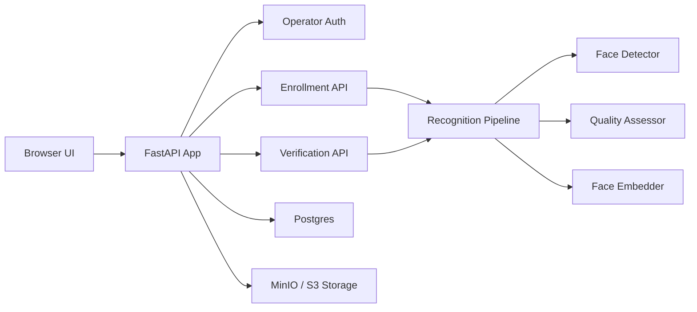

# FaceProof

[](https://github.com/bishaldan/faceproof/actions/workflows/ci.yml)
[](./LICENSE)
[](#quick-start-with-docker)
[](https://fastapi.tiangolo.com/)
[](https://www.postgresql.org/)
[](https://min.io/)

FaceProof is a Docker-first, privacy-aware face verification platform designed for real-world operator workflows, clean open source learning, and future production adaptation.

It began as a small Tkinter prototype and has been rebuilt into a full web application with operator login, enrollment, verification, audit logs, settings, storage abstraction, Docker deployment, and a pluggable recognition pipeline.

## Why This Project Exists

Most face recognition repositories fall into one of two extremes:

- research code that is powerful but hard to deploy
- demo apps that are easy to run but hard to extend responsibly

This project is meant to sit in the middle:

- simple enough for learners and portfolio use
- structured enough for serious engineering work
- careful enough to discuss privacy, licensing, and deployment tradeoffs honestly

If you want to learn how to design a face verification system with FastAPI, Docker, Postgres, object storage, and model abstraction, this repository is built for that path.

## What You Get

- Classic, simple browser UI for non-technical operators
- Admin-assisted enrollment flow with consent
- Verification workflow with quality checks and clear result states
- Postgres-backed metadata and embedding storage
- MinIO-backed image storage with S3-compatible design
- Pluggable recognition backend with demo and ONNX-ready paths
- Operator authentication and audit logging
- Docker Compose workflow for local and self-hosted deployment
- Alembic migrations, tests, CI, and public-release repo assets

## Product Scope

This repository focuses on **face verification**, not broad surveillance or open-ended person search.

Current defaults:

- admin-assisted enrollment
- verification-oriented workflows
- embeddings as the main identity artifact
- limited enrollment image retention
- no routine verification image retention

## Architecture



## Quick Start With Docker

### 1. Clone the repository

```bash
git clone https://github.com/bishaldan/faceproof.git
cd faceproof
```

### 2. Create your environment file

```bash
cp .env.example .env
```

### 3. Start the stack

```bash
docker compose up --build -d
```

To run with a real ONNX model later:

```bash
docker compose -f docker-compose.yml -f docker-compose.onnx.yml up --build -d
```

### 4. Open the app

- App: [http://localhost:8000](http://localhost:8000)
- MinIO Console: [http://localhost:9001](http://localhost:9001)
- Postgres host port: `5433`

### 5. Sign in

Default development credentials:

- Username: `admin`
- Password: `Admin123!`

Change them before any shared deployment.

## Docker-First Developer Workflow

You do not need a local Python virtual environment for normal development.

### Common commands

```bash
make up
make logs
make test
make lint
make typecheck
make down
```

### Direct Docker commands

```bash
docker compose exec app pytest
docker compose exec app ruff check .
docker compose exec app mypy app tests
docker compose exec app python -m app.scripts.seed_demo
```

Evaluation helpers:

```bash
make manifest INPUT_ROOT=/app/sample-data
make evaluate MANIFEST=/app/reports/evaluation_manifest.json
make benchmark IMAGES="/app/sample-data/person_a/image_01.jpg /app/sample-data/person_b/image_01.jpg"
```

## Interface Overview

### Pages

- `/login`
- `/`
- `/enroll`
- `/verify`
- `/users`
- `/logs`
- `/settings`

### API Endpoints

- `POST /api/enrollments/start`
- `POST /api/enrollments/{id}/captures`
- `POST /api/enrollments/{id}/finalize`
- `POST /api/verifications`
- `GET /api/users`
- `GET /api/users/{id}`
- `POST /api/users/{id}/disable`
- `GET /api/logs`
- `GET /api/system/info`
- `GET /health`
- `GET /ready`

## Recognition Backend Strategy

### Demo backend

The default backend is intentionally simple:

- OpenCV Haar cascade for face detection
- basic image quality gating
- histogram-based embedding for demo flow validation

This keeps the repository runnable without shipping restricted model files.

### ONNX backend

The architecture is ready for a real ONNX embedding model:

- set `RECOGNITION_BACKEND=onnx`
- set `ONNX_MODEL_PATH=/path/to/model.onnx`
- rebuild the Docker image
- confirm the active backend through `/api/system/info`

This repo does **not** bundle pretrained face model weights.

Helpful docs:

- [ONNX Model Setup Guide](./docs/ONNX_MODEL_SETUP.md)
- [Evaluation and Benchmarking](./docs/EVALUATION.md)

## Privacy and Security Notes

- Face images are sensitive data
- Embeddings should be protected like credentials
- Verification snapshots are not retained by default
- Enrollment images are stored in a limited, review-oriented way
- Secrets belong in environment variables, not in Git
- Public demo deployments should never use real personal data

See [SECURITY.md](./SECURITY.md) for reporting and operational guidance.

## Repository Structure

```text
app/                    FastAPI app, routes, templates, services
alembic/                Database migrations
tests/                  Automated tests
legacy/                 Preserved Tkinter prototype
docs/                   Roadmap and publishing documentation
docker-compose.yml      Local stack orchestration
Dockerfile              App image definition
```

## Roadmap

Short-term:

- plug in a real ONNX model backend
- add screenshots and a short demo video
- benchmark threshold behavior on a real validation set
- improve logs and settings UX

Mid-term:

- liveness / PAD support
- stronger role-based access
- evaluation scripts and benchmark report
- cloud deployment reference

Long-term:

- attendance mode
- desktop wrapper
- stronger public dataset benchmarking

Detailed plans:

- [Implementation Plan](./docs/IMPLEMENTATION_PLAN.md)
- [ONNX Model Setup Guide](./docs/ONNX_MODEL_SETUP.md)
- [Evaluation and Benchmarking](./docs/EVALUATION.md)
- [Publishing Checklist](./docs/PUBLISHING_CHECKLIST.md)
- [Release Notes Draft](./docs/RELEASE_NOTES_v0.1.0.md)

## Open Source Readiness

This repository includes:

- MIT license
- security policy
- contribution guide
- code of conduct
- CI workflow
- issue templates
- pull request template

## Inspiration and Design Direction

The presentation direction for this repo was informed by strong open source documentation patterns and face-analysis repositories such as:

- [InsightFace](https://github.com/deepinsight/insightface)
- [face_recognition](https://github.com/ageitgey/face_recognition)
- [facenet-pytorch](https://github.com/timesler/facenet-pytorch)
- [Readme Best Practices](https://github.com/jehna/readme-best-practices)

This project does not copy their implementations directly. It borrows the clearer parts of their documentation style: quick starts, caveats, roadmap clarity, and realistic usage framing.

## How To Make This Repo Stand Out

If you want this repository to earn trust, forks, and stars, the highest-impact next steps are:

1. Add 3 to 5 clean screenshots of the UI.
2. Record a 30 to 60 second enrollment/verification demo GIF.
3. Plug in one real ONNX model and document benchmark caveats honestly.
4. Publish a release with a polished description, GitHub topics, and release notes.
5. Share the project with a short write-up about the engineering choices, not just the code.

## License

This project is licensed under the [MIT License](./LICENSE).
